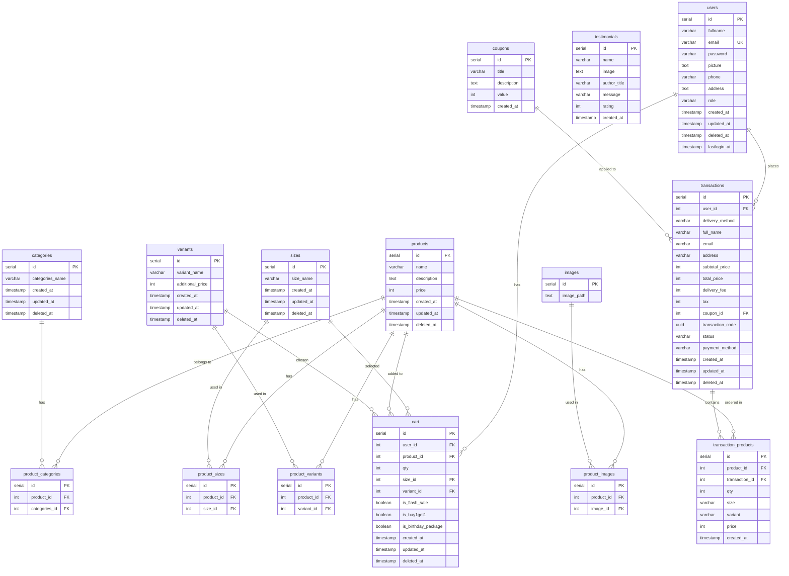

# coffeshop erd

```mermaid
erDiagram
    users {
        serial id PK
        varchar fullname
        varchar email UK
        varchar password
        text picture
        varchar phone
        text address
        varchar role
        timestamp created_at
        timestamp updated_at
        timestamp deleted_at
        timestamp lastlogin_at
    }

    categories {
        serial id PK
        varchar categories_name
        timestamp created_at
        timestamp updated_at
        timestamp deleted_at
    }

    products {
        serial id PK
        varchar name
        text description
        int price
        timestamp created_at
        timestamp updated_at
        timestamp deleted_at
    }

    cart {
        serial id PK
        int user_id FK
        int product_id FK
        int qty
        int size_id FK
        int variant_id FK
        boolean is_flash_sale
        boolean is_buy1get1
        boolean is_birthday_package
        timestamp created_at
        timestamp updated_at
        timestamp deleted_at
    }

    product_categories {
        serial id PK
        int product_id FK
        int categories_id FK
    }

    sizes {
        serial id PK
        varchar size_name
        timestamp created_at
        timestamp updated_at
        timestamp deleted_at
    }

    product_sizes {
        serial id PK
        int product_id FK
        int size_id FK
    }

    variants {
        serial id PK
        varchar variant_name
        int additional_price
        timestamp created_at
        timestamp updated_at
        timestamp deleted_at
    }

    product_variants {
        serial id PK
        int product_id FK
        int variant_id FK
    }

    images {
        serial id PK
        text image_path
    }

    product_images {
        serial id PK
        int product_id FK
        int image_id FK
    }

    testimonials {
        serial id PK
        varchar name
        text image
        varchar author_title
        varchar message
        int rating
        timestamp created_at
    }

    coupons {
        serial id PK
        varchar title
        text description
        int value
        timestamp created_at
    }

    transactions {
        serial id PK
        int user_id FK
        varchar delivery_method
        varchar full_name
        varchar email
        varchar address
        int subtotal_price
        int total_price
        int delivery_fee
        int tax
        int coupon_id FK
        uuid transaction_code
        varchar status
        varchar payment_method
        timestamp created_at
        timestamp updated_at
        timestamp deleted_at
    }

    transaction_products {
        serial id PK
        int product_id FK
        int transaction_id FK
        int qty
        varchar size
        varchar variant
        int price
        timestamp created_at
    }

    users ||--o{ cart : "has"
    sizes ||--o{ cart : "selected"
    products ||--o{ cart : "added to"
    variants ||--o{ cart : "chosen"
    products ||--o{ product_categories : "belongs to"
    categories ||--o{ product_categories : "has"
    products ||--o{ product_sizes : "has"
    products ||--o{ product_variants : "has"
    sizes ||--o{ product_sizes : "used in"
    products ||--o{ product_images : "has"
    variants ||--o{ product_variants : "used in"
    users ||--o{ transactions : "places"
    images ||--o{ product_images : "used in"
    products ||--o{ transaction_products : "ordered in"
    transactions ||--o{ transaction_products : "contains"
    coupons ||--o{ transactions : "applied to"
```
