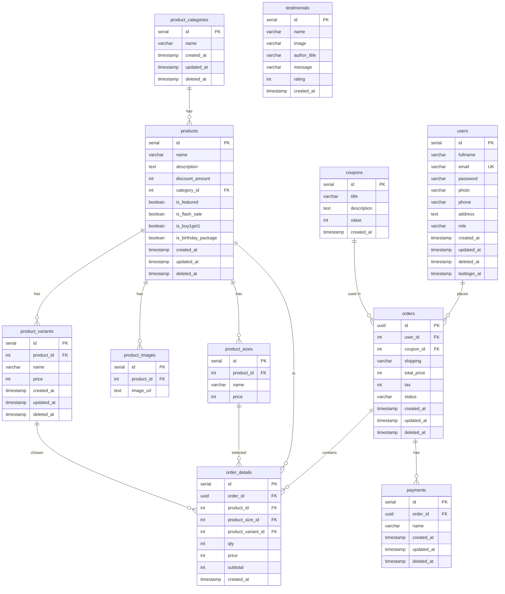

# coffeshop erd
 

```mermaid
erDiagram
    users {
        serial id PK
        varchar fullname
        varchar email UK
        varchar password
        varchar photo
        varchar phone
        text address
        varchar role
        timestamp created_at
        timestamp updated_at
        timestamp deleted_at
        timestamp lastlogin_at
    }

    product_categories {
        serial id PK
        varchar name
        timestamp created_at
        timestamp updated_at
        timestamp deleted_at
    }

    products {
        serial id PK
        varchar name
        text description
        int discount_amount
        int category_id FK
        boolean is_featured
        boolean is_flash_sale
        boolean is_buy1get1
        boolean is_birthday_package
        timestamp created_at
        timestamp updated_at
        timestamp deleted_at
    }

    product_sizes {
        serial id PK
        int product_id FK
        varchar name
        int price
    }

    product_images {
        serial id PK
        int product_id FK
        text image_url
    }

    product_variants {
        serial id PK
        int product_id FK
        varchar name
        int price
        timestamp created_at
        timestamp updated_at
        timestamp deleted_at
    }

    testimonials {
        serial id PK
        varchar name
        varchar image
        varchar author_title
        varchar message
        int rating
        timestamp created_at
    }

    coupons {
        serial id PK
        varchar title
        text description
        int value
        timestamp created_at
    }

    orders {
        uuid id PK
        int user_id FK
        int coupon_id FK
        varchar shipping
        int total_price
        int tax
        varchar status
        timestamp created_at
        timestamp updated_at
        timestamp deleted_at
    }

    order_details {
        serial id PK
        uuid order_id FK
        int product_id FK
        int product_size_id FK
        int product_variant_id FK
        int qty
        int price
        int subtotal
        timestamp created_at
    }

    payments {
        serial id PK
        uuid order_id FK
        varchar name
        timestamp created_at
        timestamp updated_at
        timestamp deleted_at
    }

    %% Relationships
    product_categories ||--o{ products : "has"
    products ||--o{ product_sizes : "has"
    products ||--o{ product_images : "has"
    products ||--o{ product_variants : "has"
    users ||--o{ orders : "places"
    coupons ||--o{ orders : "used in"
    orders ||--o{ order_details : "contains"
    orders ||--o{ payments : "has"
    products ||--o{ order_details : "in"
    product_sizes ||--o{ order_details : "selected"
    product_variants ||--o{ order_details : "chosen"
```
